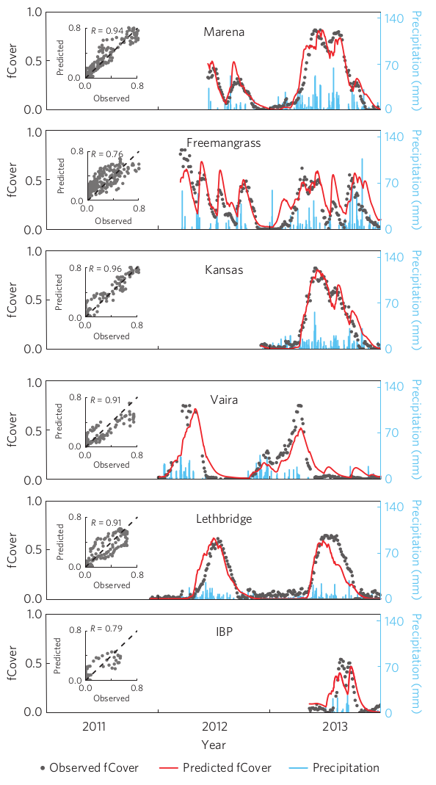

[](https://travis-ci.org/khufkens/phenograss-example)
<a href="https://www.buymeacoffee.com/H2wlgqCLO" target="_blank"></a>
<a href="https://liberapay.com/khufkens/donate"></a>

# PhenoGrass Model Example

This is a working example of the PhenoGrass model as described in the Nature Climate Change paper: ["Productivity of North American grasslands is increased under future climate scenarios despite rising aridity"](http://www.nature.com/nclimate/journal/vaop/ncurrent/full/nclimate2942.html) by myself and co-authors. When using this code (adapted or not) reference it as:

Hufkens K., Keenan T. F., Flanagan L. B., Scott R. L., Bernacchi C. J., Joo E., Brunsell N. A., Verfaillie J. & Richardson A. D. (2016). Productivity of North American grasslands is increased under future climate scenarios despite rising aridity. Nature Climate Change, 6, 710 - 714.

Note that this work has been released under a [Affero Genaral Public License V3](http://www.affero.org/) and any use of this code is therefore bound to this agreement. In particular this means that source code has to be open source and freely available to the public. The model as formulated here was built upon the framework by [Choler et al. 2010](http://www.biogeosciences.net/7/907/2010/). I'm indebted to the authors for this framework.

### Model parameters

The model parameters as listed in the publication above are rounded. The exact parameters used by the code above are listed the parameters folder. Below I list them again but with parameter name for clarity (which is lacking in the parameter file itself). Assignment of these parameters can be found in the `phenograss.f90` as of [line 35](https://github.com/khufkens/phenograss-example/blob/8b573210e0d2c2ce175a41abfd82701216dfed22/phenograss.f90#L35).

|**Parameter**|**Value**|
|:---      |:---:  |
|b1       |124.502121|
|b2       |0.00227958267|
|b3       |0.0755224228|
|b4       |0.519348383|
|L        |2.4991734|
|Phmin    |8.14994431|
|h        |222.205673|
|g        |33.3597641|
|Phmax    |37.2918091|

### Figure 1

In particular this is a worked example which recreates Figure 1 of the journal article. It therefore includes a subset of the original data (due to size restrictions) and uses the parameters and model framework as used throughout the rest of the publication.

Either download the zipped project or clone the project using:

```git
git clone https://github.com/khufkens/phenograss.git
```

Subsequently, run the Figure_1.r R script in the created directory:

On Linux or OSX you can call this script directly using:

```bash
Rscript Figure_1.r
```

All model output and the generated PDF figure can be found in the output subdirectory within the root directory of the project. The result should look like the image below.



### Notes:

The code depends on a working gfortran compiler, which is freely available for all OS. However, you are on your own when it comes to rewriting the R code for Windows. The current code should run out of the box on Linux and OSX
